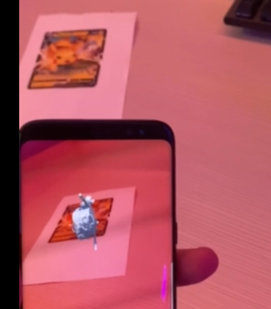

## First Week

### 24/09/2024 + 01/10/2024

#### Project Summary

Welcome to Project Schoolmon.
The goal of the project is to make students across subjects to interact more with each other.

To achieve this goal we are making a game called Schoolmon

Schoolmon is an AR project that uses the players subjects in their education as their schoolmons, they can then fight other students/players to catch more schoolmons.

Players / students will be battling each other using their respective schoolmon, by answering trivia about the subject that their schoolmon represents.

Example:

Player 1 - Software Engineer - Extended reality

Player 2 - Global Business Engineer - Team management

1. Player 1 uses an attack and has to answer a question relation to the XR course
2. Player 1 gets it right! The attack deals more damage!
3. Player 2 uses a HARD attack and has to answer a HARD question in relation to the Team management course
4. Player 2 answers wrong :( They miss their attack...
5. Player 1 uses a HARD attack.
6. Player 1 gets it right.
7. Player 1 WINS!!!
8. Player 1 can now catch the Team management Schoolmon!
9. The team management Schoolmon is added to player 1's team

### Tasks for 01/10/24

#### Task 1: Setup repository and make som virtual tracking of cards (Simon Sohn)


A good bit of the time was used to get familiar with the environment. Like how to edit simulated environment. Other than that i set up a listener for the AR Image Tracker, where I simply implemented unitys example. We have to use the listener since we want many models associated to different cards, and as far as I know, the AR Image Tracker only supports one model at a time.

To find out which model to use for each image, I thought of using the name of the image as a key to find the model, which would have the same name. This way we can easily find the model that corresponds to the image.

```csharp
foreach (var newImage in evtArgs.added)
{
    //Debug.Log($"Image added: {newImage.referenceImage.name}");
    foreach (var prefab in prefabs)
    {
        if (newImage.referenceImage.name == prefab.name)
        {
            GameObject instantiated = Instantiate(prefab, newImage.transform.position, newImage.transform.rotation);
            Debug.Log($"Instantiated: {instantiated.name}");
            instantiatedPrefabs.Add(instantiated);
        }
    }
}
foreach (var updatedImage in evtArgs.updated)
{
    //Debug.Log($"Image updated: {updatedImage.referenceImage.name}");
    foreach (var instantiatedPrefab in instantiatedPrefabs)
    {
        Debug.Log($"Instantiated: {instantiatedPrefab.name} Updated: {updatedImage.referenceImage.name}");
        if (instantiatedPrefab.name.Contains(updatedImage.referenceImage.name))
        {
            Debug.Log($"Updating: {instantiatedPrefab.name}");
            instantiatedPrefab.transform.position = updatedImage.transform.position;
        }
    }
}

```

But as you can read in the code, I had to use Contains, which i wasn't very pleased with. Since it would be an instantiation of a prefab, it would get clone on it. Using contain might limit naming possibilities, and I don't like the idea of removing the clone part of the name and so on. So I will probably change this going forward, probably just by linking the img to a model in the inspector.

We also tried it on a phone, and it worked! Had some trouble in the beginning since my tracking didn't work (didn't use contain then). But after that it worked fine.

Found it funny to see how much better a iphones first estimation of the image location was compared to the android. Big gamer moment!

Here is a pic of the android tracking the image:



Jep, thats pretty mush it, love and all that!

#### Task 2: Create 3D model for the XR-Course-mon (Simon Due)

##### XR - Schoolmon

The idea in the approach:

- Drawing the model in 2D using paint
- Using online tool to reformat the 2D .png to a 3D model.
- Import model to unity

An online tool called Tripo was used to reformat the 2D image to a 3D model - however it was found that the software used for the reformatting is for humanoid creatures, although it might not seem like it - the 2D model was supposed to look like it had 4 legs.
Alas the sub-optimal 3D model was imported to unity to see it in action, but in the process of converting the online 3D model and importing it seems some parts of the 3D model were left out. No materials where provided for the model, and the rigging that the software was supposed to do, didnt come with either.

Another approach for converting the 2D image and importing it

###### 2D image


###### 3D model


###### 3D model imported to unity


#### Task 3 : Create 3D model for SDJ-course-mon (Merethe)
I have focused a lot on 3D modeling in Blender. Blender is a program I’ve never tried before, and it’s definitely not very intuitive, so I’ve had to watch a lot of different tutorials to get a decent understanding of it and its tools. I wanted to start by making a Schoolimon right away, but I realized I lacked knowledge of the various functions — so instead, I started by creating the famous donut. With these tools, I could continue modeling “Bugsy,” which is meant to represent SDJ1.

To create Bugsy, I used CoPilot to have AI generate a still photo that could be used as a modeling reference in Blender.


Since I wanted to experiment with Blender's features, I added hair and used BlenderKit’s addon to apply materials to Bugsy’s appearance. Bugsy is built using:

- Mirror editing
- Sculpting
- Snapping bases (so the different parts are more cohesive)
- Grouping, so the whole figure is connected
- etc.
