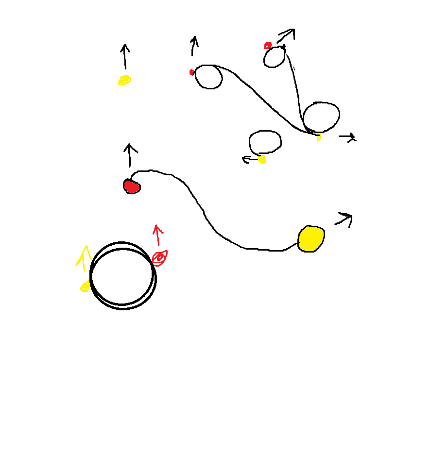

### 08/10/2024 - 22/10/2024

#### Project Summary

##### Task 1 : Update of tracking of monsters and introducing a simple state system

yea boy, its me.

Last time I build up some simple tracking for the cards, but I wanted to make it a bit more dynamic. But i wasn't that happy with it, since it was a bit of a pain of adding more logic to it, and using file names as a sorting form didn't feel like a good solution.

So i removed the card logic from the AR Image Tracker listener into a monster manager.

In here, you now instantiate the monster obj, and update them.

```csharp
[SerializeField] private MonsterInstance[] monsters;
    public void InstantiateMonster(string imgName, Vector3 position, Quaternion rotation)
    {
        MonsterInstance monster = FindMonsterFromImage(imgName);
        if (monster != null)
        {
            //Debug.Log("Instantiating Monster: " + monster.trackedImage.name + " at " + position);
            Debug.Log("prefab scale: " + monster.prefab.transform.localScale);
            GameObject monsterInstance = Instantiate(monster.prefab, position, rotation);
            IParentCardUpdater parentCardUpdater = monsterInstance.GetComponent<IParentCardUpdater>();
            if (parentCardUpdater != null)
            {
                parentCardUpdater.Init(position, rotation, monster.prefab);
            }
            else
            {
                throw new System.Exception("Missing IParentCardUpdater in Monster Prefab: " + monster.prefab.name);
            }
            monster.Instance = parentCardUpdater;
        }
    }

    public void UpdateMonsterPosition(string imgName, Vector3 position, Quaternion rotation)
    {
        MonsterInstance monster = FindMonsterFromImage(imgName);
        if (monster != null)
        {
            Debug.Log("Updating Monster: " + monster.trackedImage.name + " at " + position);
            //monster.Instance.transform.position = position;
            monster.Instance.UpdateParentCard(position, rotation);
        }
    } ... more code after here

    [System.Serializable]
    public class MonsterInstance
    {
        [SerializeField] public GameObject prefab;
        [SerializeField] public Texture2D trackedImage;
        private IParentCardUpdater instance;

        public IParentCardUpdater Instance
        {
            get => instance;
            set => instance = value;
        }
    }
}
```

In here you simple state the image its connected to, the Monster instance has a prefab and a texture2D.

The MonsterInstance class also has a IParentCardUpdater, which is a interface that is used to update the monster on whats happening with its parent card.

```csharp
public interface IParentCardUpdater
{
    void Init(Vector3 position, Quaternion rotation, GameObject parentCard);
    void UpdateParentCard(Vector3 position, Quaternion rotation);
}
```

I also implemented some state logic in the monster manager, which is used to update the monster state.

Right now the monsters can be in 4 states, Inactive, Spawning, Idle and Despawning.

Right now in idle, the monster simply moves in a lerp towards a wanted position.

```csharp
    public void Update()
    {
        monster.transform.position = Vector3.Lerp(monster.transform.position, monster.CalculateWantedMonPosition(), Time.deltaTime * idleMovementSpeed);
        monster.transform.rotation = Quaternion.Lerp(monster.transform.rotation, monster.parentCardRotation, Time.deltaTime * idleRotationSpeed);
        monster.despawnState.Update();
    }
```

But I did want something more advanced using either a bezier curve or give each monster a curve factor, which determines how tight a curve they can do while moving.

here is some weird drawing I did:




don't know how much sense it makes for others, but me brainy know what it means :)

##### Task 2 : Setup multiplayer

We want to feature a _'fighting'_ system in the game between 2 different users of the app.

To accommodate this we decided to use the **PUN 2**(photon) library. Photon provides a simple to get started solution to handling user-to-user interactions.
We're going to be using the built in _lobby_ system provided by photon to setup a peer-to-peer connection between 2(_or more_) users.

The photon network is using a _Master server_ to handle interactions between users. On the photon website we acquired a small student server, and providing the _app_id_ of our project to the server, it will automaticaly handle the networking part by using the photon library in Unity.

Idealy we want the players to be able to scan each other in some form and join a lobby with each other without the need of a whole different scene to set up the networking part. For now though this part is for prototyping user-to-user interactions in our project. There haven't been any major considerations in this part as the goal was to get networking to work in our AR project.

Below is a small technical explanation about how we used the Photon library and how it works behind the scenes.

###### Creating room & Joining a room:

```csharp
private void Start()
    {
        PhotonNetwork.ConnectUsingSettings();
    }
```

When the game is started the player will be connected to the photon server. The **PhotonNetwork** keyword can then be used to do other networking actions on the Photon server.


When creating a room(_lobby_) the user will be connected to our photon server and a room is created if the checks passes. The _creator_ of the room will be set as a _master_client_ which can be used to give special rights as the _creator_ of a room.

Joining a room the player will be connected to the room with the provided argument on the photon server.

###### Starting game:

```csharp
 if (PhotonNetwork.IsMasterClient)
    {
        startGameBtn.interactable = true;
    }
public void OnStartGameBtn()
    {
        NetworkManager.instance.photonView.RPC("ChangeScene", RpcTarget.All, "Game");
    }
```

If the player is the _master client_ of the rooom they can use the **Start game button**. When the button is pressed a _RPC call_ is sent out.
RPC(_remote procedure callbacks_) calls are how a request is sent to master server. As seen above we're telling the server to Activate the "_ChangeScene_" method and it should affect all connected clients in the 2nd argument.


After the request is handled by the server it returns the Callback on the **ChangeScene** function.
As seen in the screenshot it's annotated with `[PunRPC]` this means that this method can be used a Remote Procedure Callback.
This method will then change the scene on all clients connected to the room.

##### Task 3 : Animate SDJ-course-mon

With some light feedback, Bugsy in his current state was a good fit for a horror game, so he received an upgrade to look a bit friendlier.


However, when I tried to import Bugsy into Unity, the textures I had used didn’t come along because they weren’t part of the "Principled BSDF" under shading.


Alternatively, I could have saved the additional elements as external textures and then added them separately in Unity, but I decided to prioritize focusing on animation instead (disadvantage of using an addon appearently :) ).

Now i was ready to add animations in form of poses. To do this, i added an "armature" object, which gives the model a skeleton.


It quickly became clear that some parts of Bugsy weren’t connected as i thought. For instance, it was important to use weight painting to indicate which body parts should move when the bones are manipulated, as Blender’s automatic weights weren’t quite accurate. It was also important to consider where to place the bones to make it easier to move the different parts when adding animations. I found inspiration from animal skeletons online (not as creepy as it sounds).

Since Bugsy isn’t a humanoid figure, it was difficult to find automatic animations online, so i had to explore and add keyframes myself.


Once again, i needed to see several tutorials until i understood how to use the animation function in Blender. As i began to understand the basic principles, i drew inspiration from “Pose to Pose: Blender Animation Workflow for Beginners” on YouTube, which helped me figure out how to approach Bugsy’s poses.

I animated a still pose that can be used when Bugsy is rendered in Unity. The still pose involves Bugsy simply moving up and down in his position, running in a loop. I also aim to animate attacks, but that will depend on available time.

Finally, i saved each frame after running “Render Animation,” allowing these frames to be used in Blender’s Video Editor for a clean rendering without the lags that often occur during editing. However, i noticed that the different poses were a bit too close together, causing Bugsy to move up and down rather quickly. This would also need to be adjusted before Bugsy could be used in Schoolimon.

Now, Bugsy is ready to be used in Unity!

When Bugsy was added to Unity, the animation needed some adjustments to ensure the loop was smooth. Since this was also a new program for me, there were many tools to familiarize myself with. I however managed to add the animation, keeping Bugsy in the same position without any movement, and the loop worked as intended.

Since the goal is for Bugsy to be able to perform attacks, i used the “Animator” function to create a state machine, making it easier to implement a "fighting" pose in the future.


##### Next steps

We still have some features we want the project to have before we feel like our MVP is complete. Below is some of the key elements we'll be working on for our (_probably_) last devlog for **project schoolmon**

###### Fighting

To have a complete loop it makes sense for us, that two players having joined the same lobby is able to fight each other with their mons.
The key elements we need to make before this feature is complete, from our understanding is:

- Healthbar to the mons
- Attacking the opposing mon, by answering 1 of 4 questions
  - Simple system to calculate damage done to healthbar
  - '_despawning'_ mon when health < 0

###### Networking in the game

We have done the setup, and can now connect to players to our photon masterserver. However we have yet to actualize using it in the games scene.
Some of the key elements we want to work on for this part is:

- Finding a way to handle whos mon is whos
- Setting up turnbased actions

###### Missing states

- What should happen when a card cant be found anymore, when the camera is looking at the position where the card should be.
- The switch mon state is not gonna work as intended, we will only have 2 mons in game, one for each player, so no need for switching.

###### Animations??

Er der noget logik her der skal laves her Merethe til de forskellige animationer? :D
