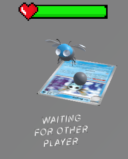
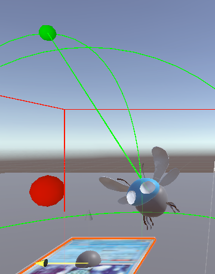
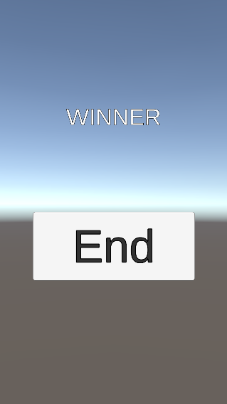

### AR Project

#### Task 1: Finishing gameplay loop & setting up multiplayer functionality ingame

##### Start when both players are ready

Made it so combat only starts when both players have found their own monster. Until then, the combat won't start. Right now this is simply set in the network manager in a boolean which is set on a RPC. 

```csharp
    public static bool pl1Ready = false;
    public static bool pl2Ready = false;
    ...

    [PunRPC]
    public void MonsterSelected(string player, string monsterName, string sendFrom)
    {
        Debug.Log("Monster selected: " + monsterName + " by " + player);
        if (player.Equals(thisPlayer.ToString()))
        {
            pl1Ready = player.Equals(sendFrom);
            NetworkManager.monsterName = monsterName;
        }
        else
        {
            pl2Ready = player.Equals(sendFrom);
            otherMonsterName = monsterName;
        }
    }
    ...
```

This is mostly done so people cant begin answering questions before the other player is ready for a fight. Think this code should be in some state manager or something instead of this.

##### Turn Based System



When one player has picked a move, it should wait for the other player to pick a move. We don't want a scenario where one can simply speed press the answers, especially when there is no penalty in doing so (*other than not damaging the other monster*).

Its meant to be played like this, new turn, player answers question, waits for other player to pick move, now that both players have done so, new question.

##### First to pick answers moves first

Instead of giving speed stats to monster, it's gonna be how fast the player can answer the questions. 

##### Logic for monster life

Made it so the monster life bar can be decreased across server.

Also life bar spawns and despawns with the monster.

Other than that, fixed a scenario where lets say:
*player 1 one is damaging player 2's monster, but player 1 doesn't have player 2's monster initiated on their screen*. 

This was fixed by introducing some pending damage logic on the spawning of the HealthBar.

```csharp
public class Health : MonoBehaviour
{
    ...    
    public static int pendingDamage = 0;

    void Start()
    {
        healthBarManager = FindFirstObjectByType<HealthBarManager>();
        monster = GetComponent<Monster>();
        healthBarManager.SpawnHealthBar(this);
        if (pendingDamage > 0 && monster.monsterName == NetworkManager.otherMonsterName)
        {
            TakeDamage(pendingDamage);
            pendingDamage = 0;
        }
        healthBarManager.TurnOffHealthBar(this);
    }
    ...
}
```

Using a lot of static variables around the code, not happy about many of them. This one would be bad if we the game ever needed multi-combat in some form. But since we don't expect more than 2 monster in this game and no switching, its fine.

##### Monster movement

Began thinking about implementing custom movement logic for monsters. Just did some for Bugsy the bug.



What are we seeing on the img? The red dot is its wanted position, while the green dot is a position for calculating the monster up facing direction.
This is done so it looks like the bug is flying towards its next position.

```csharp
    [SerializeField] private Vector3 topDirectionOffset = new Vector3(0, 0.1f, 0);
    [SerializeField] private float topDirectionSpeed = 3f;
    ...

    public void Update()
    {
        monster.transform.position = Vector3.Lerp(monster.transform.position, monster.CalculateWantedMonPosition(), Time.deltaTime * monster.idleState.idleMovementSpeed);
        monster.transform.rotation = Quaternion.Lerp(monster.transform.rotation, monster.parentCardRotation, Time.deltaTime * monster.idleState.idleMovementSpeed);

        Vector3 topDirectionPosition = CalculateTopDirectionPosition();
        Debug.DrawLine(monster.transform.position, topDirectionPosition, Color.green);

        // Make the monster's up vector point toward the target position
        Vector3 directionToLook = topDirectionPosition - monster.transform.position;
        if (directionToLook.magnitude > 0.1f)
        {
            Quaternion targetRotation = Quaternion.FromToRotation(monster.transform.up, directionToLook) * monster.transform.rotation;
            monster.transform.rotation = Quaternion.Lerp(
                monster.transform.rotation,
                targetRotation,
                Time.deltaTime * topDirectionSpeed
            );
        }
    }
    ...
```

Didn't get to make one for the other monster, but thing it would be jumping from one fot to the other in a cutesy way.

##### De-/spawn logic

###### Despawn logic


Made it so the monster despawns if the camera is within a certain radius of the presumed card position but no img reference is found. The radius is the green wire circle.

Made a legal play area for the card movement. It works by defining a zone (*The red wire box*) and the ca. box for the card (*gray wire box, can barely be seen in pic*), then the code checks whether the card is within the legal play area.
    
```csharp
    ...
    public bool BoxWithinLegalPlayZone()
    {
        Vector3 localPosition = cardStartRotation * (monster.parentCardPosition - cardStartPosition);
        Quaternion localRotation = Quaternion.Inverse(cardStartRotation) * monster.parentCardRotation;

        Vector3 halfExtentsZone = legalPlayZone * 0.5f;
        Vector3 halfExtentsBox = monster.cardzone * 0.5f;

        Vector3[] boxCorners = GetBoxCorners(localPosition, localRotation, halfExtentsBox);

        foreach (var corner in boxCorners)
        {
            if (corner.x < -halfExtentsZone.x || corner.x > halfExtentsZone.x ||
                corner.y < -halfExtentsZone.y || corner.y > halfExtentsZone.y ||
                corner.z < -halfExtentsZone.z || corner.z > halfExtentsZone.z)
            {
                return false;
            }
        }

        return true;
    }

    private Vector3[] GetBoxCorners(Vector3 position, Quaternion rotation, Vector3 halfExtents)
    {
        Vector3[] corners = new Vector3[]{
            calculateLocalCorner(new Vector3(-halfExtents.x, -halfExtents.y, -halfExtents.z), position, rotation),
            calculateLocalCorner(new Vector3(-halfExtents.x, -halfExtents.y, halfExtents.z), position, rotation),
            calculateLocalCorner(new Vector3(-halfExtents.x, halfExtents.y, -halfExtents.z), position, rotation),
            calculateLocalCorner(new Vector3(-halfExtents.x, halfExtents.y, halfExtents.z), position, rotation),
            calculateLocalCorner(new Vector3(halfExtents.x, -halfExtents.y, -halfExtents.z), position, rotation),
            calculateLocalCorner(new Vector3(halfExtents.x, -halfExtents.y, halfExtents.z), position, rotation),
            calculateLocalCorner(new Vector3(halfExtents.x, halfExtents.y, -halfExtents.z), position, rotation),
            calculateLocalCorner(new Vector3(halfExtents.x, halfExtents.y, halfExtents.z), position, rotation)
        };
        return corners;
    }
    ...
```

Before this implementation, the legal zone would move with the card from time to time, but we moved away from that setup.

Now, despawning doesn’t work very well on the Android phone we used in class. It works fine on PC and the iPhones we've tested. When I checked why, it seemed like the phone had trouble figuring out the rotation of the cards. It also had issues determining the position of the cards, often placing them lower than expected. On top of that, it struggled to remember where the cards were positioned when the phone was moved around.

Now why is this a problem? Can only guess.
* Phones are old: While I've seen other AR projects work with decent precision, it might be harder for the phones to recognize our relatively small cards, where precision failures are more noticeable.
* Image not good for tracking: One thing we never did was check the trackability of the cards. We just assumed it would work. It might be smart to run the image checker for Unity's image tracker.
* Have read that some prefer other img tracker than the one Unity provides. Might be worth looking into.
* Unlucky with phone
* Performance: phone got pretty hot.
* Some bug in code... dunno.

Might turn off the despawn when we show the project in class, doesn’t feel very cool when the monster just disappears and reappears in an infinite loop.

Plus right now despawning doesn't have an impact on the online play, since it was meant as a way of switching monsters, but we haven't implemented that. So it's just a visual thing.

###### Check if card is visible on spawn

Added that the card had to have been spotted recently before spawning. 

###### Endscreen



comes when one wins match, pressing button stops application.

###### Nice to haves

Would have had been nice with a system, where if one players systems sees a change in monster system, it would update the other players system. So that they could help each other with recognizing the cards positioning.

### Task 2: Healthbar implementation on schoolmons and quiz logic
For the first part of the fighting setup, i focused on creating a health bar to be placed above the schoolimon. I created a canvas in unity with an image component, adding sprites for the health bar border and a heart symbol. The health bar uses a Slider component for the fill, which changes based on the schoolimon’s health value. The fill itself is just a simple image component.

Once the visual setup was done, i added the logic to update the health bar based on the schoolimon’s health!

##### HealthBar.cs
The HealthBar script is responsible for managing the health bar's appearance. It has a reference to a Slider, Gradient, and Image. The Slider adjusts as the health changes, the Gradient changes color based on the health, and the Image is the fill that changes as the health decreases.
```csharp
public void UpdateHealthBar(int health)
{
    slider.value = health;
    fill.color = gradient.Evaluate(slider.normalizedValue);
}
```

In the setter for health, i ensure that the healthBar only has one health, and that it is instantiated with correct health values, and it adds the UpdateHealthBar method to the onHealthChanged event. 

```csharp
	public Health Health
	{
		get => health; set
		{
			if (health != null)
			{
				health.OnHealthChanged -= UpdateHealthBar;
			}

			health = value;
			slider.maxValue = Health.maxHealth;
			health.OnHealthChanged += UpdateHealthBar;
			UpdateHealthBar(health.currentHealth);
		}
	}

```

This way it automatically updates when the health changes.

##### HealthBarManager.cs
The HealthBarManager script handles multiple health bars. It spawns health bars when needed, updates their positions, and toggles them on or off depending on the schoolimon's state.
First, we have the SpawnHealthBar method, and it creates and links the health bar to the target health:
```csharp
    public void SpawnHealthBar(Health health)
    {
        var healthBar = Instantiate(healthBarPrefab, transform);
        healthBars.Add(healthBar.GetComponent<HealthBar>());
        healthBar.GetComponent<HealthBar>().Health = health;
    }

```
It is saved to a list, so we can keep track of all the healthbars, which makes it easier to work with, when we implement networking, so we can keep track of all the active bars.

HealthBarManager also has an offset value, that sets the height og the health bar, above the schoolimon.

It also have logic to set a health bar active or inactive, giving the possibility to adjust when the health bar is spawned, depending on the state of the schoolimon. 

##### Health.cs
This is the fun one!
Health manages the health logic for each schoolimon. It reduces health when damage is taken and triggers the UpdateHealthBar method, so we actually get the effect of losing health. 
The scripts has a healthBarManager, so it is possible to individually show/not show the health bar for each schoolimon. It also attaches that this health, shall have a health bar. 
```csharp
    void Start()
    {
        healthBarManager = FindFirstObjectByType<HealthBarManager>();
        monster = GetComponent<Monster>();
        healthBarManager.SpawnHealthBar(this);
        if (pendingDamage > 0 && monster.monsterName == NetworkManager.otherMonsterName)
        {
            TakeDamage(pendingDamage);
            pendingDamage = 0;
        }
        healthBarManager.TurnOffHealthBar(this);
    }
```
So the entire logic for each schoolimon, is set in this script.

Now with bugsy being the tester, it looked as it should!

  

(Notice that bugsy has gottes his own schoolimon card! :D )

##### From health bar logic to the quizzzzzz
Now that the logic for the health bars were set up, i needed to implement a new canvas, that would show some questions with associated answers. The whole idea was, that if i answered a question correctly, the entire logic for the schoolimon taking damage, should be applied - and if i choose an incorrect answer, no damage should be applied.

SOOOO back at it again with the canvas!


### VR Project
##### About the project
The idea for our VR project is to create a game in the _Foddian_ genre centered around climbing a mountain using physics.
The game is called **Climbing Over it** - and is heavily inspired by [A difficult game about climbing](https://store.steampowered.com/app/2497920/A_Difficult_Game_About_Climbing/) and [Gorilla Tag](https://store.steampowered.com/app/1533390/Gorilla_Tag/).
With this in mind we expect that these will be some of the major systems/designs needed to be implemented in order to have a working MVP.

**_Objectives_**:
- Setting up VR project & connect our Quest 3(_We have one at home_) to develop the game
- Figure out how to use the tools / packages Unity provides for VR development
- Setting up hand tracking to move around without controllers
- Creating an appealing world to immerse the user
- Creating an interesting level(_mountain_) for the player to climb
- Figure out how to use physics in VR games

##### Task 0: Init the project & setting up link between headset and PC
###### Init project
When initting the project we wanted to have something to work with at the start, therefor we decided to start up using Unitys built in _VR Core_ template. With a template in place we tried to connect with our headset using _Meta quest link_, however some hardware / internet issues made it so we had to use _Meta Quest developer hub_ instead and test our project by directly building to the headset through a USB-C cable.

This makes it harder to debug or adjust values on the fly - but at least we can test the application at home :)

We decided to deviate from the initial plan of working from the _VR core_ template, as it had some innate rendering project settings and a metric ton of package bloat, that we didn't need nor knew how to get started using. Therefor we made an empty _3D URP_ project and worked our way slowly from there, as to get more control of settings / imports.

###### Terrain 
As one of our projects was to create an appealing world we wanted to create some sort of immersive terrain. Since the objective of the game is to climb a moutain we thought it made good sense the **3D Object Terrain**.
This object includes a **Terrain** component, which allows us to mold a natural field by hand and create something resembling a real mountain. We accomplised creating a mountain in our terrain by using the built-in _Paint terrain_ tool in the **Terrain** component.

After molding the terrain we wanted to make the environment more immersive by adding some sorrounding trees / objects & color. For this segment we imported
- _environment models_: [low-poly-simple-nature-pack](https://assetstore.unity.com/packages/3d/environments/landscapes/low-poly-simple-nature-pack-162153)
- _terrain textures_: [Polyhaven](https://polyhaven.com/textures/terrain)

The _environment models_ were used in the _Paint trees_ tool in the **Terrain** component, by inputting the models we want to use for our enviroment as _Trees_, we can make auto generate a huge immersive forest randomly using the models in _Trees_ section.

The _terrain textures_ were used to paint the terrain to make the colors resemble how a real mountain location would look. This was done by using the **Terrain** component, and using the _Paint Texture_ tool.

Below is the final result of the terrain from different angles


##### Task 1: Hand tracking & XR Rig
To immerse the user in the application we thought it would make sense for the user to climb with their hands and not with their controllers. Most modern VR Headsets has built in body tracking, so it should be possible to implement(_hopefully)_.

To accomplish Hand tracking we're going to be using these packages
- XR interaction tool kit
- XR hands

The **XR Tool kit** provides us with a prefab of a _XR Rig_, that we can use as inspiration when creating our own rig. However to visualise our hands in a fully virtual environment with this _XR Rig_, we need to also use **XR Hands**. This package contains tools to visualise the hands. 

There's not a lot of work for us to do here right now - as by using these packages in combination makes it very close to plug and play. However we give up a lot of control this way in how our rig operates, and later down the line we want to create our own _Climbing rig_. 

We decided to leave this part as is for now, and come back later after creating a physics system, since after playing around with the _XR Rig_ and some of its settings we found that applying a physics system to the existing _XR Rig_ seemed to be quite the undertaking, and very poorly documented as we're working with a new version of the **XR Tool kit**, that hasn't been explored thorughly online yet. Then later we can come back and slowly add components to our _Climbing Rig_. Below is a scrrentshot of the the devil that is the _XR Rig_ hierachy.


##### Next steps
###### Physics system
We NEED to make a physics system on a rig asap, as this is the core of the project.
- We don't really have a concrete plan for this yet as there's not a lot of material online, we have to improvise a bit here
- All we know is we need to figure out how to make a _RigidBody_ interact seamlessly with a rig somehow
- Also some kind of math to get momentum like in _A difficuly game about climbing_

###### Level creation
We want to create a finished level as to create a finished gameplay loop.
- Should be able to climb up to the top
- Should be able to fall down
- _Maybe be able to grab stuff along the way up / down_

###### Upgrading the world design
We want to make the world more immersive
- Adding cloud system to make the user feel like they are VERY high up in the air when climbing
- Adding sound system to make the interaction with the world feel more satisfying and real
