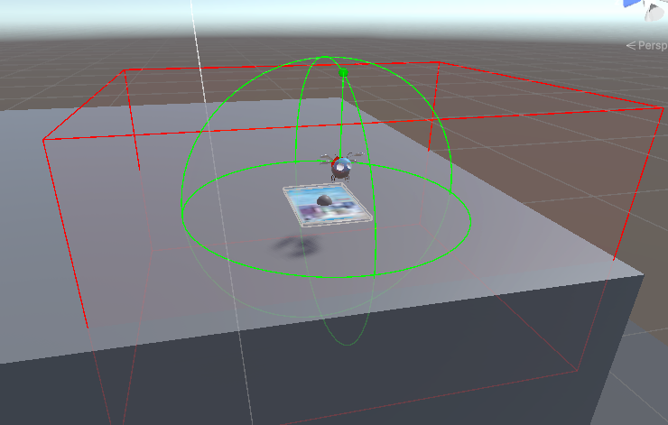

### 29/10/2024 - 12/11/2024

### AR Project

#### Task 1: Finishing gameplay loop & setting up multiplayer functionality ingame

##### Start when both players are ready

Made it so combat only starts when both players have found their own monster. Until then, the combat won't start. Right now this is simply set in the network manager in a boolean which is set on a RPC. 

```csharp
    public static bool pl1Ready = false;
    public static bool pl2Ready = false;
    ...

    [PunRPC]
    public void MonsterSelected(string player, string monsterName, string sendFrom)
    {
        Debug.Log("Monster selected: " + monsterName + " by " + player);
        if (player.Equals(thisPlayer.ToString()))
        {
            pl1Ready = player.Equals(sendFrom);
            NetworkManager.monsterName = monsterName;
        }
        else
        {
            pl2Ready = player.Equals(sendFrom);
            otherMonsterName = monsterName;
        }
    }
    ...
```

This is mostly done so people cant begin answering questions before the other player is ready for a fight. Think this code should be in some state manager or something instead of this.

##### Turn Based System


When one player has picked a move, it should wait for the other player to pick a move. We don't want a scenario where one can simply speed press the answers, especially when there is no penalty in doing so (*other than not damaging the other monster*).

Its meant to be played like this, new turn, player answers question, waits for other player to pick move, now that both players have done so, new question.

##### First to pick answers moves first

Instead of giving speed stats to monster, it's gonna be how fast the player can answer the questions. 

##### Logic for monster life

Made it so the monster life bar can be decreased across server.

Also life bar spawns and despawns with the monster.

Other than that, fixed a scenario where lets say:
*player 1 one is damaging player 2's monster, but player 1 doesn't have player 2's monster initiated on their screen*. 

This was fixed by introducing some pending damage logic on the spawning of the HealthBar.

```csharp
public class Health : MonoBehaviour
{
    ...    
    public static int pendingDamage = 0;

    void Start()
    {
        healthBarManager = FindFirstObjectByType<HealthBarManager>();
        monster = GetComponent<Monster>();
        healthBarManager.SpawnHealthBar(this);
        if (pendingDamage > 0 && monster.monsterName == NetworkManager.otherMonsterName)
        {
            TakeDamage(pendingDamage);
            pendingDamage = 0;
        }
        healthBarManager.TurnOffHealthBar(this);
    }
    ...
}
```

Using a lot of static variables around the code, not happy about many of them. This one would be bad if we the game ever needed multi-combat in some form. But since we don't expect more than 2 monster in this game and no switching, its fine.

##### Monster movement

Began thinking about implementing custom movement logic for monsters. Just did some for Bugsy the bug.


What are we seeing on the img? The red dot is its wanted position, while the green dot is a position for calculating the monster up facing direction.
This is done so it looks like the bug is flying towards its next position.

```csharp
    [SerializeField] private Vector3 topDirectionOffset = new Vector3(0, 0.1f, 0);
    [SerializeField] private float topDirectionSpeed = 3f;
    ...

    public void Update()
    {
        monster.transform.position = Vector3.Lerp(monster.transform.position, monster.CalculateWantedMonPosition(), Time.deltaTime * monster.idleState.idleMovementSpeed);
        monster.transform.rotation = Quaternion.Lerp(monster.transform.rotation, monster.parentCardRotation, Time.deltaTime * monster.idleState.idleMovementSpeed);

        Vector3 topDirectionPosition = CalculateTopDirectionPosition();
        Debug.DrawLine(monster.transform.position, topDirectionPosition, Color.green);

        // Make the monster's up vector point toward the target position
        Vector3 directionToLook = topDirectionPosition - monster.transform.position;
        if (directionToLook.magnitude > 0.1f)
        {
            Quaternion targetRotation = Quaternion.FromToRotation(monster.transform.up, directionToLook) * monster.transform.rotation;
            monster.transform.rotation = Quaternion.Lerp(
                monster.transform.rotation,
                targetRotation,
                Time.deltaTime * topDirectionSpeed
            );
        }
    }
    ...
```

Didn't get to make one for the other monster, but thing it would be jumping from one fot to the other in a cutesy way.

##### De-/spawn logic

###### Despawn logic



Made it so the monster despawns if the camera is within a certain radius of the presumed card position but no img reference is found. The radius is the green wire circle.

Made a legal play area for the card movement. It works by defining a zone (*The red wire box*) and the ca. box for the card (*gray wire box, can barely be seen in pic*), then the code checks whether the card is within the legal play area.
    
```csharp
    ...
    public bool BoxWithinLegalPlayZone()
    {
        Vector3 localPosition = cardStartRotation * (monster.parentCardPosition - cardStartPosition);
        Quaternion localRotation = Quaternion.Inverse(cardStartRotation) * monster.parentCardRotation;

        Vector3 halfExtentsZone = legalPlayZone * 0.5f;
        Vector3 halfExtentsBox = monster.cardzone * 0.5f;

        Vector3[] boxCorners = GetBoxCorners(localPosition, localRotation, halfExtentsBox);

        foreach (var corner in boxCorners)
        {
            if (corner.x < -halfExtentsZone.x || corner.x > halfExtentsZone.x ||
                corner.y < -halfExtentsZone.y || corner.y > halfExtentsZone.y ||
                corner.z < -halfExtentsZone.z || corner.z > halfExtentsZone.z)
            {
                return false;
            }
        }

        return true;
    }

    private Vector3[] GetBoxCorners(Vector3 position, Quaternion rotation, Vector3 halfExtents)
    {
        Vector3[] corners = new Vector3[]{
            calculateLocalCorner(new Vector3(-halfExtents.x, -halfExtents.y, -halfExtents.z), position, rotation),
            calculateLocalCorner(new Vector3(-halfExtents.x, -halfExtents.y, halfExtents.z), position, rotation),
            calculateLocalCorner(new Vector3(-halfExtents.x, halfExtents.y, -halfExtents.z), position, rotation),
            calculateLocalCorner(new Vector3(-halfExtents.x, halfExtents.y, halfExtents.z), position, rotation),
            calculateLocalCorner(new Vector3(halfExtents.x, -halfExtents.y, -halfExtents.z), position, rotation),
            calculateLocalCorner(new Vector3(halfExtents.x, -halfExtents.y, halfExtents.z), position, rotation),
            calculateLocalCorner(new Vector3(halfExtents.x, halfExtents.y, -halfExtents.z), position, rotation),
            calculateLocalCorner(new Vector3(halfExtents.x, halfExtents.y, halfExtents.z), position, rotation)
        };
        return corners;
    }
    ...
```

Before this implementation, the legal zone would move with the card from time to time, but we moved away from that setup.

Now, despawning doesn’t work very well on the Android phone we used in class. It works fine on PC and the iPhones we've tested. When I checked why, it seemed like the phone had trouble figuring out the rotation of the cards. It also had issues determining the position of the cards, often placing them lower than expected. On top of that, it struggled to remember where the cards were positioned when the phone was moved around.

Now why is this a problem? Can only guess.
* Phones are old: While I've seen other AR projects work with decent precision, it might be harder for the phones to recognize our relatively small cards, where precision failures are more noticeable.
* Image not good for tracking: One thing we never did was check the trackability of the cards. We just assumed it would work. It might be smart to run the image checker for Unity's image tracker.
* Have read that some prefer other img tracker than the one Unity provides. Might be worth looking into.
* Unlucky with phone
* Performance: phone got pretty hot.
* Some bug in code... dunno.

Might turn off the despawn when we show the project in class, doesn’t feel very cool when the monster just disappears and reappears in an infinite loop.

Plus right now despawning doesn't have an impact on the online play, since it was meant as a way of switching monsters, but we haven't implemented that. So it's just a visual thing.

###### Check if card is visible on spawn

Added that the card had to have been spotted recently before spawning. 

###### Endscreen


comes when one wins match, pressing button stops application.

##### Task 2: Healthbar implementation on schoolmons

### VR Project
##### Task 0: Init the project & setting up link between headset and PC
- Demo project -> empty 3d project
- Building directly to headset

Terrain
- Low Poly terrain
- Training table
- Terrain colors?

##### Task 1: Hand tracking
packages:
- XR interaction tool kit
- XR hands
